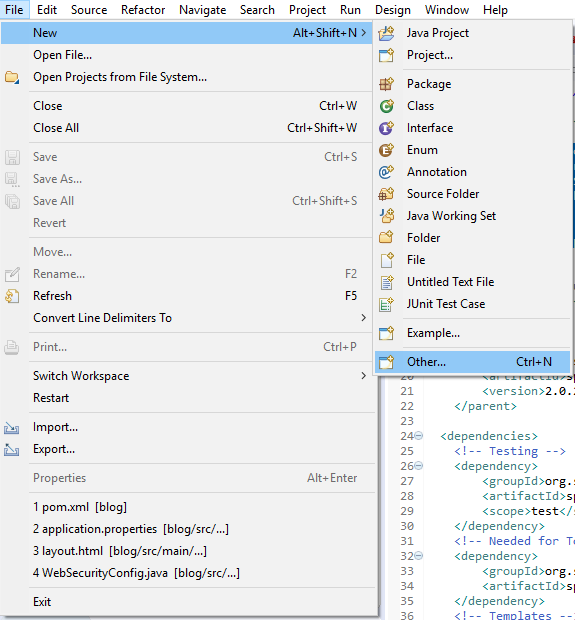
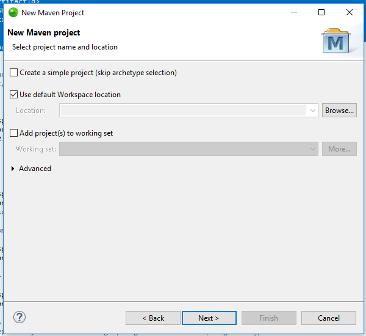
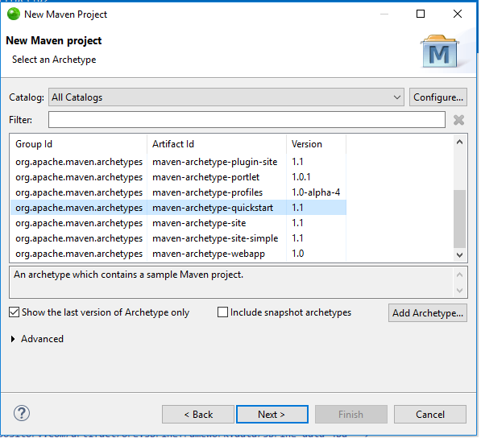
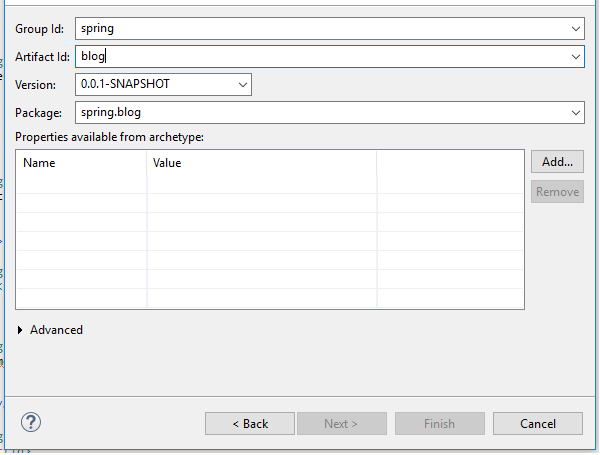
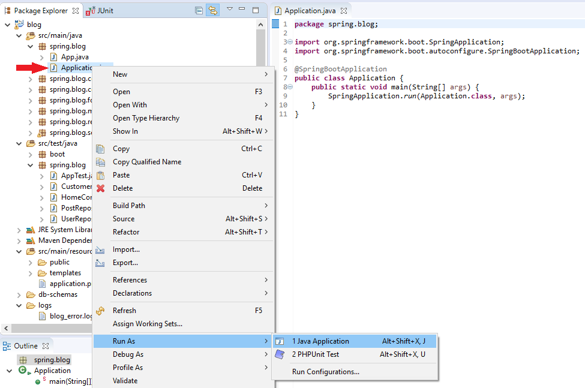
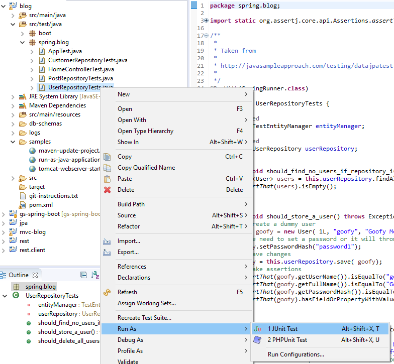

# Création d'un système de blog avec Java Spring MVC, Thymeleaf, JPA et MySQL

- [x] Validation de l'utilisateur
- [x] Cryptage du mot de passe
- [x] Rôles
- [x] Permissions
- [x] Pagination(côté client et côté serveur)

## Certains des outils/composants que j'ai utilisés sur ce projet

- [x] Eclipse et IntelliJ
- [x] MySQL
- [x] Maven
- [x] Java 
- [x] JPA / Hibernate
- [x] Spring Boot
- [x] Spring MVC
- [x] Spring Security
- [x] JQuery
- [x] Thymeleaf
- [x] Bootstrap 4
- [x] Font-Awesome

## Créer le projet

Assurez-vous de créer le projet Maven avec la structure suivante
```
  <groupId>spring</groupId>
  <artifactId>blog</artifactId>
  <version>0.0.1-SNAPSHOT</version>
  <packaging>jar</packaging>

  <name>blog</name>
  <url>http://maven.apache.org</url>
```
## Instructions





### Installation
Une fois le projet créé, clonez ce référentiel dans votre environnement local et laissez Maven opérer sa magie.


### Créez le fichier application.properties sous le dossier src/main/resources avec les paramètres suivants :

```
# ==============================================================
# src/main/resources/application.properties
# ==============================================================
#  Le serveur utilise le port 
# ==============================================================
server.port=8090

# ===============================
# = Configurations Thymeleaf
# ===============================
spring.thymeleaf.cache=FALSE

# ==============================================================
# = Désactiver la page d'erreur de marque blanche 
# ==============================================================
server.error.whitelabel.enabled=FALSE

# ==============================================================
# = SOURCE DE DONNÉES - MySQL

# ==============================================================
spring.datasource.driver-class-name=com.mysql.cj.jdbc.Driver
spring.datasource.url=jdbc:mysql://localhost:3306/blog_db?characterEncoding=utf8&useSSL=false&serverTimezone=Africa/Dakar
spring.datasource.username=<YOUR_DB_USERNAME>
spring.datasource.password=<YOUR_DB_USERPASSWORD>

# ==============================================================
# = Spring Security / Requêtes pour AuthenticationManagerBuilder 
# ==============================================================
spring.queries.users-query=select user_name, password_hash, id from users where user_name=?
#spring.queries.roles-query=select u.user_name, r.role from users u inner join user_role ur on(u.user_id=ur.user_id) inner join role r on(ur.role_id=r.role_id) where u.user_name=?

# Je ne veux pas utiliser de rôles pour l'instant, alors définissez tout comme ADMIN
# ==============================================================

#Si vous voulez utiliser hasRole('ADMIN'), utilisez ceci :
#spring.queries.roles-query=select user_name, 'ROLE_ADMIN' AS 'role' from users where user_name=?
# ==============================================================
# if you want to use hasAuthority('ADMIN'), use this:
spring.queries.roles-query=select user_name, 'ADMIN' AS 'role' from users where user_name=?

# ==============================================================
# = JPA / HIBERNATE
# ==============================================================
# Configurez Hibernate DDL mode: create / update
# 	spring.jpa.properties.hibernate.hbm2ddl.auto = create
# 	spring.jpa.properties.hibernate.hbm2ddl.auto = update
#
# Créer la base de données avec hbm2ddl.auto
# Assurez-vous que hbm2ddl est activé (valeur "create"). REMARQUE, cela doit être fait une fois !!!, après avoir créé le changement initial de configuration de la base de données pour mettre à jour
# Cela supprimera la base de données au démarrage de l'application et recréera les tables de la base de données en fonction des classes d'entités trouvées dans le projet.
# ==============================================================
spring.jpa.show-sql=TRUE
spring.jpa.properties.hibernate.hbm2ddl.auto=update
```

### A propos de la base de données
```
Si vous souhaitez créer la base de données manuellement, ouvrez le fichier step-1-db-create.sql situé sous le dossier db-schemas et exécutez-le sur MySQL.

J'inclus également un deuxième fichier .sql pour insérer des exemples de données.
```

## Lancez l'application

Ouvrez le fichier Application.java situé sous le dossier spring.blog + clic droit + Exécuter en tant que + Application Java et attendez que tous les composants soient chargés 
(vérifiez la console, elle vous indiquera quand le serveur Web Tomcat sera prêt).




## Testez  l'application

Développez le dossier src/test/java/spring.blog et choisissez l'un des fichiers répertoriés.
Le processus est à peu près ce que vous avez fait ci-dessus pour exécuter l'application, mais dans ce cas, vous devez sélectionner Run As + JUnit Test, voir ci-dessous.





